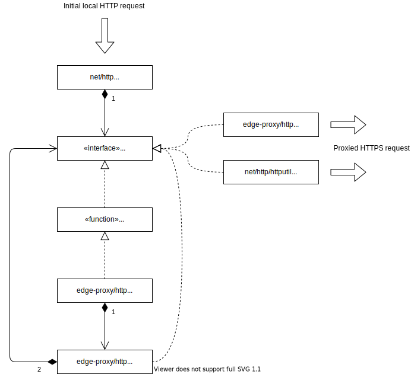

# edge-proxy
* Proxy service on the edge providing HTTP routing service for gateway-based services and reserve tunnel service for cloud-based services.

# Use Cases
1) A cloud-based service needs to make a request to gateway-based service
2) A gateway-based service needs to make a request to a cloud-based service

# Proxy composition diagram

This is a diagram showing how the various components connect together to proxy a request originating locally through to a remote server.



Command show in this diagram:
```
$ fp-edge \
-proxy-uri=https://my.proxy.com \
-tunnel-uri=ws://my.service.local/edge-proxy/connect \
-cert-strategy=file \
-cert-strategy-options=cert=certs/gateway-cert.pem \
-cert-strategy-options=key=certs/gateway-private-key.pem \
-forwarding-addresses={\"my.service.local\":\"my.service.com\"}
```

Proxy routing:
1. An HTTP request is received from a program running on the gateway
1. The 'Host' header is updated based on the mapping in the 'forwarding-addresses' parameter. If no mapping is found the 'Host' header is set to the hostname of the proxy. The URL hostname is then updated to match that of the new 'Host' header
1. The request is converted to HTTPS and the port is changed to 443. The request type, path and headers are left unchanged from the previous step.

Notes
- All requests from edge-proxy to the cloud are done over HTTPS
- The path component of the URL is never changed for a proxied request
